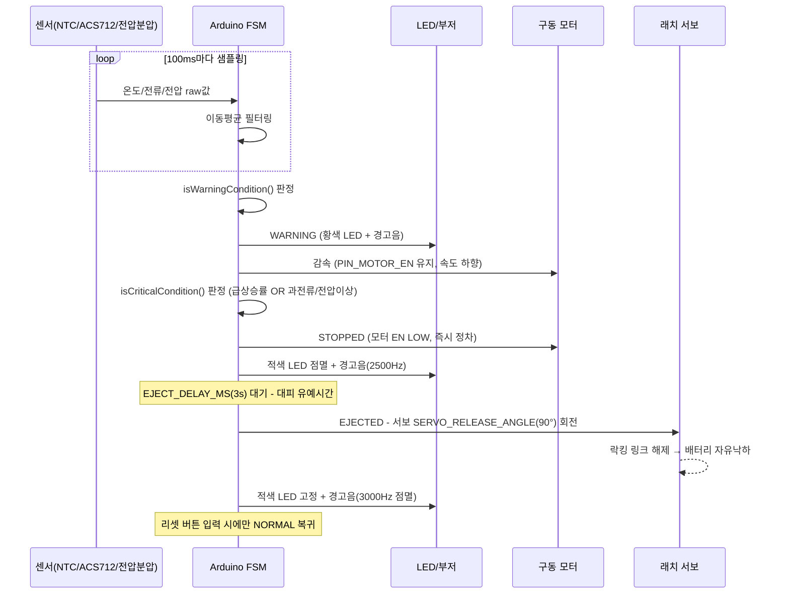
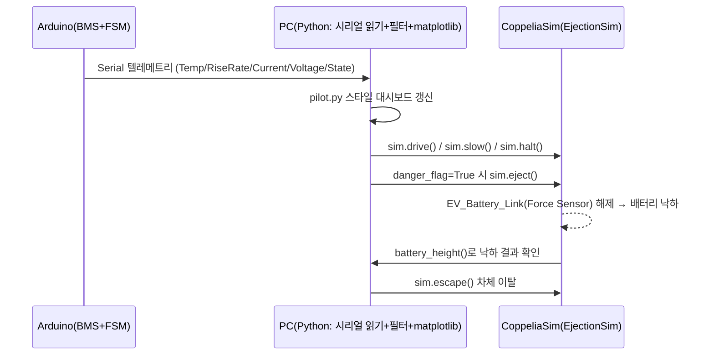
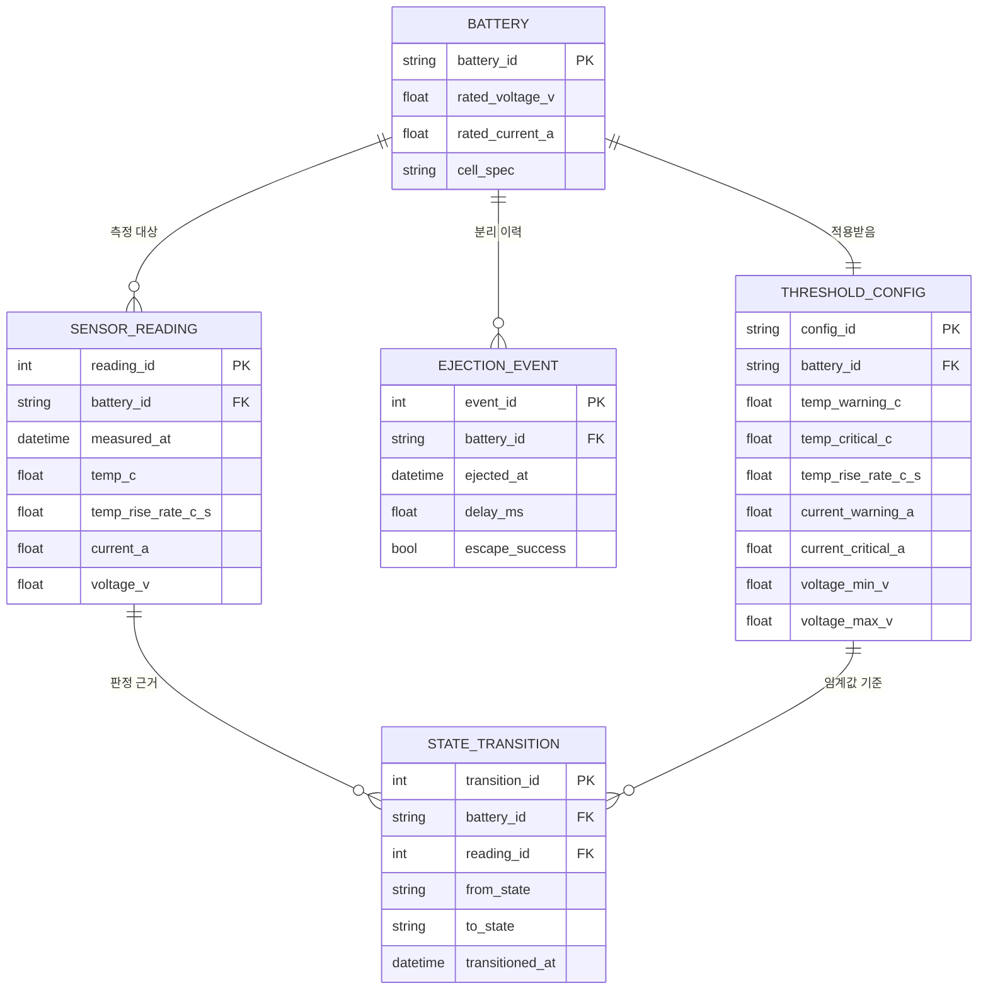

# 프로젝트 기획 문서

`README.md`가 "무엇을 만들었는가"를 설명한다면, 이 문서는 **"왜 이렇게 만들기로 했는가"** 를 정리한 기획 파트입니다.
발표 시 기획 단계(문제 정의 → 설계 → MVP) 질문에 대응하기 위한 문서입니다.

---

## 1. RFP (요구사항 정리)

### 1-1. 배경
지하주차장 등 밀폐 공간에서 EV 배터리 열폭주(Thermal Runaway) 화재가 발생하면, 단순 S/W 경고나 전원 차단만으로는 화재가 차체 전체로 번지는 것을 막을 수 없습니다.

### 1-2. 프로젝트 목표
> 배터리의 과열/과전류/전압 이상을 조기에 감지하면, 화재가 번지기 전에 **배터리 팩을 차체에서 물리적으로 분리·투하**하는 안전 모빌리티를 구현한다.

### 1-3. 기능 요구사항 (Functional Requirements)

| ID | 요구사항 | 근거 |
| --- | --- | --- |
| F1 | 온도(NTC)·전류(ACS712)·전압(분압회로) 3종 센서로 배터리 상태를 실시간 측정한다 | [`SENSORS.md`](SENSORS.md) |
| F2 | 이동평균 필터로 센서 노이즈를 제거한다 | `BatteryEjectionSystem.ino` `MovingAverage` |
| F3 | NORMAL → WARNING → STOPPED → EJECTED 4단계 상태기계로 위험 수준을 판단한다 | `BatteryEjectionSystem.ino` FSM |
| F4 | 온도 급상승률(°C/s) + 과전류/전압이상 복합 조건으로 위험을 판단한다(단일 임계값 오탐 방지) | `isCriticalCondition()` |
| F5 | 상태별로 LED/부저로 시각·청각 경고를 출력한다 | 아두이노 FSM `updateIndicators()` |
| F6 | WARNING 시 감속, STOPPED 시 즉시 정차한다 | `PIN_MOTOR_EN` 제어 |
| F7 | 위험 판정 후 유예시간(`EJECT_DELAY_MS`) 뒤 서보 래치를 해제해 배터리를 물리적으로 분리한다 | `EJECTED` 상태 진입 |
| F8 | 분리 후 차체는 현장에서 이탈(ESCAPE)한다 | CoppeliaSim `sim.escape()` |
| F9 | 리셋 버튼으로 EJECTED → NORMAL 복귀가 가능해야 한다(반복 테스트용) | `handleResetButton()` |
| F10 | 실제 하드웨어 제작 전에 회로/FSM 로직(Tinkercad)과 물리적 분리 동작(CoppeliaSim)을 각각 시뮬레이션으로 선검증한다 | `simulation/` |

### 1-4. 비기능 요구사항 (Non-functional Requirements)

| ID | 요구사항 |
| --- | --- |
| N1 | 오탐(false positive)으로 정상 주행 중 배터리가 분리되면 안 됨 → 복합 조건 판단 필수 |
| N2 | 평상시(주행 진동/충격)에는 래치가 절대 풀리지 않아야 함 (기계적 안전마진) |
| N3 | 위험 판단 후 실제 분리까지 대응 지연이 최소화되어야 함 |
| N4 | 센서 캘리브레이션 값은 부품 교체 시 코드 상수만 바꿔 대응 가능해야 함 (`CAUTIONS.md`) |

### 1-5. 제약 조건 및 범위 밖(Out of Scope)
- 실제 완성차 규격이 아닌 소형 모빌리티(테스트 차체) 기준 프로토타입
- 실제 리튬셀 열폭주가 아닌 센서 값 모사(Tinkercad) / 물리 낙하 모사(CoppeliaSim)로 검증
- 장애물 회피(HC-SR04)는 1단계 주행 로직으로 별도 확장 항목

---

## 2. 문제해결 방향 결정

### 2-1. 문제 재정의
"배터리를 어떻게 더 안전하게 만들 것인가"가 아니라, **"화재가 이미 시작됐을 때, 그 열원을 차체와 물리적으로 분리하는 데 걸리는 시간을 어떻게 최소화할 것인가"** 로 문제를 재정의했습니다.

### 2-2. 검토한 대안과 선택

| 대안 | 내용 | 채택 여부 | 사유 |
| --- | --- | --- | --- |
| A. S/W 경고만 | 경고등/알림만 표시 | ❌ 미채택 | 화재 확산을 막는 근본 대책이 아님 (기존 차량 수준) |
| B. 전원 즉시 차단 | 릴레이로 배터리 회로 차단 | ❌ 단독 미채택 | 열폭주는 전기적 차단만으로 막을 수 없음(이미 진행 중인 발열) |
| C. **물리적 분리(Ejection)** | 래치 해제 후 배터리를 차체에서 낙하·이격 | ✅ 채택 | 열원 자체를 차체(승객/적재물)로부터 물리적으로 격리 — 확산 원천 차단 |
| D. 사람이 수동 분리 | 운전자가 버튼으로 분리 | ❌ 보조 수단으로만 채택 | 열폭주는 초 단위로 진행 → 자동 판단이 필수, 수동은 리셋 등 보조 기능으로만 사용 |

### 2-3. 접근 전략
1. **감지(BMS)** — 온도/전류/전압 3종 센서 + 필터링으로 오탐 없는 위험 판단
2. **판단(FSM)** — 단일 임계값이 아닌 "급상승률 + 복합조건"으로 실제 열폭주 전조를 구분
3. **분리(로보틱스)** — 서보 기반 락킹/릴리즈 래치로 기계적 신뢰성 확보
4. **검증(시뮬레이션 우선)** — 실물 제작 전 Tinkercad(회로/FSM)와 CoppeliaSim(물리적 분리)으로 각각 선검증 후 하드웨어 통합

---

## 3. 시퀀스 다이어그램

### 3-1. 정상 → 위험 감지 → 분리 → 이탈 (실동작 시나리오)



### 3-2. 시뮬레이션 통합 흐름 (팀 통합 파트)



---

## 4. 데이터 구조화

### 4-1. 상태 데이터 (SystemState)

```
enum SystemState { NORMAL, WARNING, STOPPED, EJECTED }
```

| 상태 | 진입 조건 | 탈출 조건 |
| --- | --- | --- |
| NORMAL | 초기값 / WARNING에서 정상 복귀 | 위험 조건 충족 시 WARNING·STOPPED로 |
| WARNING | `filteredTempC ≥ TEMP_WARNING_C` OR `filteredCurrentA ≥ CURRENT_WARNING_A` | 정상 복귀 또는 위험 조건 충족 |
| STOPPED | `isCriticalCondition()` = true | `EJECT_DELAY_MS` 경과 시 자동 진행 |
| EJECTED | STOPPED에서 유예시간 경과 | 리셋 버튼(`PIN_RESET_BTN`) |

### 4-2. 센서 측정값 구조 (필터링 전/후)

| 필드 | 타입 | 단위 | 비고 |
| --- | --- | --- | --- |
| `filteredTempC` | float | °C | NTC, Steinhart-Hart 식으로 변환 후 이동평균 |
| `currentTempRiseRate()` | float | °C/s | `RISE_RATE_WINDOW_MS`(2s) 구간 기준 계산값 |
| `filteredCurrentA` | float | A | ACS712 출력 → 전류 환산 후 이동평균 |
| `filteredVoltageV` | float | V | 분압 회로 출력 × `VOLTAGE_DIVIDER_RATIO` |

이동평균 필터 구조(`MovingAverage`): 고정 크기(`FILTER_SIZE=8`) 원형 버퍼 + 누적합(`sum`)으로 O(1) 갱신.

### 4-3. 텔레메트리 패킷 (시리얼 출력 포맷)

```
Temp:<°C>	RiseRate:<°C/s>	Current:<A>	Voltage:<V>	State:<NORMAL|WARNING|STOPPED|EJECTED>
```
(`printTelemetry()`, `TELEMETRY_INTERVAL_MS`=200ms마다 출력 — 시리얼 플로터/PC 대시보드가 그대로 파싱해서 사용)

### 4-4. 시뮬레이션 제어 명령 구조 (`ejection_sim.py`)

| 명령 | 파라미터 | 매핑되는 FSM 상태 |
| --- | --- | --- |
| `drive(left, right)` / `forward(speed)` | rad/s | NORMAL |
| `slow()` | - | WARNING |
| `halt()` | - | STOPPED |
| `eject()` | - | EJECTED (1회성, idempotent) |
| `escape(speed, duration)` | rad/s, s | EJECTED 이후 이탈 연출 |

---

## 5. ERD

이 프로젝트는 실시간 제어가 핵심이라 별도 DB를 두지 않지만, **데모 로그/발표 자료용으로 텔레메트리를 기록·분석**한다고 가정했을 때의 논리적 데이터 모델입니다. (`시리얼 텔레메트리` → 로그 테이블 적재 시나리오)



- `THRESHOLD_CONFIG`를 배터리(셀 스펙)별로 분리해 둔 이유: `CAUTIONS.md`에 명시된 대로 임계값은 실제 배터리 스펙에 맞춰 재설정되어야 하므로, 하드코딩이 아니라 설정 엔티티로 분리하는 것이 맞는 구조입니다.
- `STATE_TRANSITION`이 `SENSOR_READING`을 참조하는 이유: "왜 그 순간 상태가 바뀌었는지"를 항상 근거 데이터와 함께 추적하기 위함(디버깅/발표 시 근거 제시용).

---

## 6. 적정기술 선택 (Appropriate Technology)

과한 스펙보다 **이 규모의 프로토타입에 딱 맞는 기술**을 우선 선택했습니다.

| 항목 | 채택 기술 | 검토했던 대안 | 채택 사유 |
| --- | --- | --- | --- |
| 온도 센싱 | NTC 서미스터(아날로그) | DS18B20(디지털, 1-Wire) | 더 정확하지만 코드/배선 복잡도 증가 → 프로토타입 단계에는 과함 ([`SENSORS.md`](SENSORS.md)) |
| 전류 센싱 | ACS712(홀 센서 모듈) | 션트저항 + INA219(I2C) | ACS712가 배선/코드 모두 단순, 정밀도는 이 데모 목적에 충분 |
| 전압 센싱 | 저항 분압 회로 | 완제품 전압 센서 모듈 | 저비용, 계산만 정확하면 충분히 신뢰 가능 |
| 래치 구동 | SG90/MG996R 서보 | 솔레노이드, 리니어 액추에이터 | 저비용·저전력으로 각도 제어 가능, 배터리 팩 무게에 맞춰 토크만 선택하면 충분 |
| 필터링 | 이동평균(Moving Average) | 칼만 필터 | MCU 자원(8-bit, 저메모리) 안에서 실시간 노이즈 제거에 충분, 칼만필터는 과설계 |
| 위험 판단 | 임계값 + 상승률(rate) 복합조건 | 머신러닝 기반 이상탐지 | 학습 데이터 없이도 열폭주의 물리적 특징(급격한 온도 상승)을 직접 반영 가능 |
| 회로 사전검증 | Tinkercad | 브레드보드 실물 선제작 | 부품 파손/설계 오류 위험 없이 FSM 로직부터 빠르게 검증 |
| 물리 분리 사전검증 | CoppeliaSim + Force Sensor(락킹 링크) | Prismatic Joint | 조인트는 "미끄러짐"만 가능, Force Sensor는 "고정↔완전분리"가 명확히 구현됨 ([`SIMULATION.md`](simulation/SIMULATION.md)) |
| 시뮬레이터 연동 | ZeroMQ Remote API (`coppeliasim-zmqremoteapi-client`) | Legacy Remote API(`vrep.py`) | 최신 CoppeliaSim에서 Legacy API는 제거됨 — 유지보수되는 공식 경로 사용 |
| MCU | Arduino Uno | ESP32 등 | 이 규모(센서 3종 + 서보 1~2개 + LED/부저)엔 Uno로 충분, 저비용·풍부한 레퍼런스 |

---

## 7. 논리적 전개과정

문제 정의부터 구현까지의 사고 흐름을 순서대로 정리하면:

1. **문제 정의**: 열폭주 화재는 확산 속도가 빨라 S/W 경고만으로는 부족하다 → 물리적 격리가 필요하다
2. **요구사항 도출**: 격리를 하려면 (a) 정확한 위험 감지, (b) 신뢰성 있는 기계적 분리, 두 가지가 모두 필요하다 (RFP F1~F8)
3. **위험 판단 기준 설계**: 단일 임계값은 오탐(정상 주행 진동/순간 부하)에 취약함 → **급상승률 + 복합조건**으로 재설계 (`isCriticalCondition()`)
4. **기계 설계 원칙 확정**: "평상시 고정, 비상시 즉시 해제"라는 요구사항에는 조인트가 아니라 **끊어질 수 있는 강체 링크(Force Sensor)** 개념이 정확히 대응됨을 CoppeliaSim 매뉴얼 검토로 확인
5. **저비용 사전검증 우선**: 실물 제작(비용/시간 큰 리스크) 전에 Tinkercad(회로·FSM)와 CoppeliaSim(물리적 분리)으로 각각 **독립적으로** 로직을 검증
6. **단계적 통합**: 래치 단품 테스트 → 차체 기본 주행 → BMS 센서 배선 → FSM 통합 시나리오 → 실배터리 테스트 순으로, **되돌리기 쉬운 순서**로 리스크를 뒤로 미룸 ([`HARDWARE.md`](HARDWARE.md) 4장, [`CAUTIONS.md`](CAUTIONS.md) 3장)
7. **MVP 확정**: 전체 차체 완성을 기다리지 않고, "감지→판단→분리"라는 핵심 가치만 먼저 증명 가능한 범위로 MVP를 좁힘 (8절)

---

## 8. MVP 시퀀스 선정 및 구현

### 8-1. MVP 정의
> **"위험을 감지하면 배터리가 실제로 분리(낙하)된다"** — 이 한 가지 인과관계를 끊김 없이 보여주는 것이 MVP의 최소 목표.
> 완성차 수준의 차체, 실제 리튬셀, 완전한 장애물 회피는 MVP 범위 밖.

### 8-2. MVP 시퀀스 (구현 순서 = 데모 순서)

| 순서 | 단계 | 상태 |
| --- | --- | --- |
| 1 | 아두이노 FSM(NORMAL→WARNING→STOPPED→EJECTED) 코드 구현 | ✅ 완료 (`BatteryEjectionSystem.ino`) |
| 2 | Tinkercad로 회로 + FSM 로직 검증 (센서 모사, LED/부저/서보) | ✅ 완료 (`simulation/README.md` §2) |
| 3 | CoppeliaSim으로 "배터리 물리적 분리·낙하" 시각화 | ✅ 완료 (`ev_ejection.ttt`, `battery_drop_test.py`) |
| 4 | 파이썬 대시보드(온도 그래프 + 상태 표시)로 발표용 시각 자료 구성 | ✅ 완료 (`pilot.py`) |
| 5 | 센서·시뮬레이션·대시보드를 한 프로세스에서 통합 (팀 통합 파트) | ⬜ 예정 (`SIMULATION.md` §11) |
| 6 | 실물 차체 + 실제 센서 배선 + 실제 서보 래치 제작 | ⬜ 예정 (`HARDWARE.md`) |
| 7 | 실배터리(저용량) 통합 테스트 | ⬜ 예정 (`CAUTIONS.md` §3) |

### 8-3. 왜 이 순서인가
- 1~4는 **모두 소프트웨어/시뮬레이션만으로 완결** — 하드웨어 리스크 없이 핵심 가치(감지→분리 인과관계)를 가장 빠르게 증명 가능
- 5는 발표/시연의 완성도를 높이는 통합 단계
- 6~7은 실물 제작 리스크(부품 파손, 안전사고)가 있는 단계이므로 로직이 충분히 검증된 뒤로 의도적으로 미룸

---

## 참고 문서

- 4대 핵심 기술 융합 구조 및 로드맵: [`README.md`](README.md)
- 부품/배선/기구 설계: [`HARDWARE.md`](HARDWARE.md)
- 센서 선택 기준: [`SENSORS.md`](SENSORS.md)
- 캘리브레이션/안전 주의사항: [`CAUTIONS.md`](CAUTIONS.md)
- Tinkercad·CoppeliaSim 시뮬레이션: [`simulation/README.md`](simulation/README.md)
