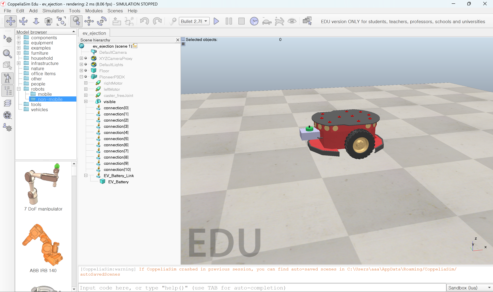

# 시뮬레이션 개요

이 폴더에는 서로 목적이 다른 **두 가지 시뮬레이션**이 들어 있습니다.

| | 담당 영역 | 무엇을 검증하는가 |
| --- | --- | --- |
| 1. Tinkercad 시뮬레이션 | 회로 / 아두이노 FSM | 센서 값 → 상태 판단 → LED/부저/서보 로직이 맞는가 |
| 2. **CoppeliaSim 3D 시뮬레이션** | 로보틱스 / 기구 매커니즘 | 배터리가 차체에서 **물리적으로 분리되어 실제로 떨어지는가** |

발표에서는 보통 2번(CoppeliaSim)이 "배터리가 툭 떨어지는" 임팩트 있는 장면이라 가장 많이 보여주는 파트입니다. 아래에 먼저 설명합니다.

---

# 1. CoppeliaSim 3D 시뮬레이션

## 왜 필요한가

Tinkercad는 회로와 아두이노 코드(FSM 로직)는 검증할 수 있지만, **배터리 팩이 실제로 차체에서 분리되어 중력으로 낙하하는 장면**은 보여줄 수 없습니다. 그 부분만 따로 3D 물리 엔진(CoppeliaSim)으로 만들었습니다.

즉, 이 파트는 새로운 회로나 로직이 아니라 **아두이노 FSM이 내리는 "배터리 분리" 결정을 3D로 시각화한 것**입니다.

## 화면



- 빨간 원통형 차체 = `PioneerP3DX` (미리 만들어진 모바일 로봇 모델을 차체 대역으로 사용)
- 왼쪽의 보라색 상자 = `EV_Battery` (배터리 팩을 모사한 큐브)
- 계층(Scene hierarchy) 트리에서 `EV_Battery`가 `EV_Battery_Link` 아래 자식으로 붙어 있는 것이 핵심 구조입니다.

## 핵심 개념 — "락킹 링크(Locking Link)"

발표에서 가장 많이 나오는 질문은 "왜 조인트가 아니라 저걸 썼냐"입니다. 한 문장으로 정리하면:

> **평소엔 배터리를 차체에 단단히 고정하고, 위험 신호가 오면 그 연결을 즉시 끊어서 자유낙하시키는 메커니즘**을 CoppeliaSim의 **Force Sensor(포스센서)**로 구현했습니다.

| 왜 조인트(Joint)가 아닌가 | 왜 포스센서(Force Sensor)인가 |
| --- | --- |
| 조인트는 축을 따라 미끄러지듯 움직일 뿐, 완전히 "끊어져서" 자유낙하하는 연출이 안 됨 | CoppeliaSim 공식 문서 정의: *두 shape 사이의 강체 링크이며, 조건이 되면 끊어질 수 있음* — 평소엔 고정, 비상시엔 분리라는 요구사항과 정확히 일치 |

씬 구조는 다음과 같습니다.

```
PioneerP3DX (차체)
  └─ EV_Battery_Link   (Force Sensor = 락킹 링크)
       └─ EV_Battery   (배터리 팩, 물리 오브젝트)
```

분리 명령이 오면 `EV_Battery`를 계층에서 떼어내(`sim.setObjectParent(..., -1)`) 락킹 링크를 해제하고, 이 순간부터 배터리는 물리 엔진(중력)의 지배를 받아 자유낙하합니다.

## 아두이노 FSM ↔ 3D 시뮬레이션 대응

발표 자료에 그대로 넣기 좋은 매핑표입니다. **로직은 100% 아두이노 쪽에 있고, CoppeliaSim은 그 결과를 그림으로 보여주는 역할**이라는 것이 포인트입니다.

| 아두이노 FSM 상태 | 3D 시뮬레이션에서 하는 일 | 화면에서 보이는 것 |
| --- | --- | --- |
| `NORMAL` | `sim.forward()` | 차체가 정상 속도로 주행 |
| `WARNING` | `sim.slow()` | 감속 주행 |
| `DANGER` / `STOPPED` | `sim.halt()` | 정차 |
| 배터리 분리 결정 | `sim.eject()` | 락킹 링크 해제 → **배터리 자유낙하** |
| 분리 이후 | `sim.escape()` | 차체가 급가속하여 현장 이탈 |


## 파일 구성

| 파일 | 역할 |
| --- | --- |
| `ev_ejection.ttt` | CoppeliaSim 씬 파일 (차체 + 배터리 + 락킹 링크) |
| `ejection_sim.py` | 씬을 제어하는 파이썬 모듈 (`connect / drive / eject / escape`) |
| `check_scene.py` | 씬 연결 및 오브젝트 이름 진단 스크립트 |
| `battery_drop_test.py` | 위 데모 시나리오를 자동 실행하는 테스트 스크립트 (분리 직전 사람이 Enter로 확인) |
| `battery_auto_drop_test.py` | 사람 확인 없이, 차가 정차한 채 일정 시간 가만히 있으면 자동으로 분리하는 시나리오 테스트 |
| `battery_drop_only_test.py` | 주행 없이 연결 직후 배터리 분리(낙하)만 바로 확인하는 최소 테스트 |
| `images/coppeliasim_scene.png` | 씬 스크린샷 |

씬을 처음부터 직접 만드는 전체 과정(용어 설명 포함, 왕초보용)은 [`SIMULATION.md`](SIMULATION.md)에 단계별로 정리되어 있습니다.

---