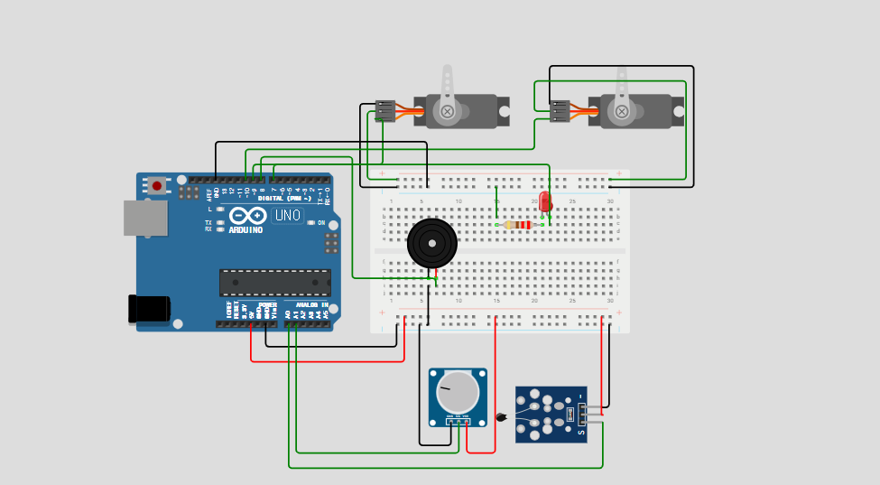
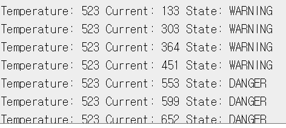

# EV 배터리 능동형 안전 분리 시스템 - Wokwi 시뮬레이션

## 프로젝트 소개

본 프로젝트는 EV 배터리의 열폭주를 조기에 감지하고, 위험 상황에서 배터리를 차량으로부터 물리적으로 분리하여 2차 피해를 최소화하는 것을 목표로 한다.

온도 센서와 전류 센서를 이용하여 배터리 상태를 실시간으로 모니터링하고, FSM(Finite State Machine) 기반 알고리즘을 통해 위험 상태를 판단한다.

위험 상태가 감지되면 LED와 부저를 통해 경고를 발생시키고, 서보모터를 이용한 배터리 분리 메커니즘을 작동시킨다.

---

## 하드웨어 구성

| 부품 | 수량 |
| --- | --- |
| Arduino Uno | 1 |
| NTC 온도 센서 | 1 |
| 가변저항 | 1 |
| LED | 1 |
| 부저 | 1 |
| 서보모터 | 2 |

---

## 회로 구성



---

## 핀 연결

| 부품 | 아두이노 핀 |
| --- | --- |
| NTC 온도 센서 | A0 |
| 가변저항 | A1 |
| LED | D7 |
| 부저 | D8 |
| 서보모터 1 | D9 |
| 서보모터 2 | D10 |

---

## FSM 상태 전이

```text
NORMAL
↓
WARNING
↓
DANGER
```

---

## 상태 설명

| 상태 | 동작 |
| --- | --- |
| NORMAL | 정상 상태 |
| WARNING | 위험 감지 및 경고 |
| DANGER | 배터리 분리 장치 작동 |

---

## 위험 감지 알고리즘

```cpp
#include <Servo.h>

const int tempPin = A0;
const int currentPin = A1;
const int buzzerPin = 8;

Servo servo1;
Servo servo2;

enum State {
  NORMAL,
  WARNING,
  STOPPED,
  EJECTED
};
State state = NORMAL;

const unsigned long EJECT_DELAY_MS = 1500; // STOPPED 유지 후 EJECTED로 넘어가기까지의 유예시간
unsigned long stoppedSince = 0;

// ---------- 실측 캘리브레이션 참고값 ----------
// 평상시(포텐셔미터 기본값) 전류 raw ≈ 197 / 전류는 0~1023 전 범위 사용 가능
// 8도: temp raw ≈ 700 / 23도: temp raw ≈ 530  (1도당 raw 약 -11.3 추정)
// 60도(raw 110) 추정치는 실측 범위(8~23도) 밖 외삽이라 헤어드라이어로 도달 불가능해서
// STOPPED 미진입 문제 발생 -> 실측 가능 범위 안으로 완화
const int WARNING_TEMP_TH = 280; // 약 45도 추정 (기존 700 -> 280)
const int CRIT_TEMP_TH    = 420; // 약 30도 추정치, 헤어드라이어로 도달 가능한 범위로 완화 (110 -> 420)
const int CRIT_CURRENT_TH = 530; // 500 -> 530으로 조정 (실측 경계값에 맞춤)

void setup() {
  Serial.begin(9600);
  servo1.attach(9);
  servo2.attach(10);
  pinMode(7, OUTPUT);
  pinMode(buzzerPin, OUTPUT);
  servo1.write(0);
  servo2.write(0);
}

void loop() {
  int temp = analogRead(tempPin);
  int current = analogRead(currentPin);

  // 상태 판단 (EJECTED는 한 번 도달하면 유지 — 배터리가 이미 분리됐으므로 되돌릴 이유 없음)
  if (state != EJECTED) {
    if (temp < CRIT_TEMP_TH && current > CRIT_CURRENT_TH) {
      if (state != STOPPED) {
        state = STOPPED;
        stoppedSince = millis();
      }
    } else if (temp < WARNING_TEMP_TH) {
      state = WARNING;
    } else {
      state = NORMAL;
    }
  }

  // STOPPED 상태로 EJECT_DELAY_MS 이상 머물렀으면 EJECTED로 전이
  if (state == STOPPED && millis() - stoppedSince >= EJECT_DELAY_MS) {
    state = EJECTED;
  }

  if (state == NORMAL) {
    digitalWrite(7, LOW);
    noTone(buzzerPin);
    servo1.write(0);
    servo2.write(0);
  }
  if (state == WARNING) {
    digitalWrite(7, HIGH);
    tone(buzzerPin, 1000);
    servo1.write(0);
    servo2.write(0);
  }
  if (state == STOPPED) {
    digitalWrite(7, HIGH);
    tone(buzzerPin, 2000);
    servo1.write(0);   // 아직 래치는 잠긴 상태 (정지만 하고 대기)
    servo2.write(0);
  }
  if (state == EJECTED) {
    digitalWrite(7, HIGH);
    tone(buzzerPin, 3000);
    servo1.write(90);  // 유예시간이 지나야 실제로 분리
    servo2.write(90);
  }

  Serial.print("Temperature: ");
  Serial.print(temp);
  Serial.print(" Current: ");
  Serial.print(current);
  Serial.print(" State: ");
  if (state == NORMAL)
    Serial.println("NORMAL");
  if (state == WARNING)
    Serial.println("WARNING");
  if (state == STOPPED)
    Serial.println("STOPPED");
  if (state == EJECTED)
    Serial.println("EJECTED");

  delay(100);
}
```

---

## 배터리 분리 메커니즘

두 개의 서보모터가 배터리를 지지한다.

위험 상태가 감지되면 두 개의 서보모터가 동시에 90° 회전하여 배터리를 분리한다.

```text
잠금
↓
해제
↓
배터리 분리
```

---

## 시리얼 모니터



---

## 시뮬레이션 동작 과정

```text
센서 데이터 수집
↓
온도 모니터링
↓
전류 모니터링
↓
WARNING
↓
LED 및 부저 경고
↓
DANGER
↓
서보모터 회전
↓
배터리 분리
```

---

## 시뮬레이션 결과

- NTC 센서를 이용한 배터리 온도 상태 모니터링
- 가변저항을 이용한 전류 이상 상황 시뮬레이션
- FSM 기반 위험 상태 판단
- LED를 이용한 시각적 경고
- 부저를 이용한 청각적 경고
- 서보모터를 이용한 배터리 분리
- 시리얼 모니터를 통한 실시간 상태 확인
